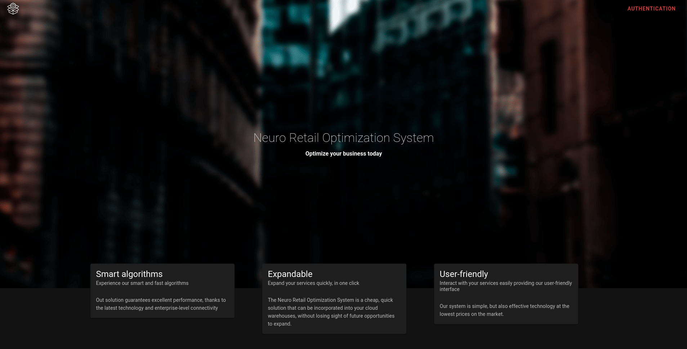
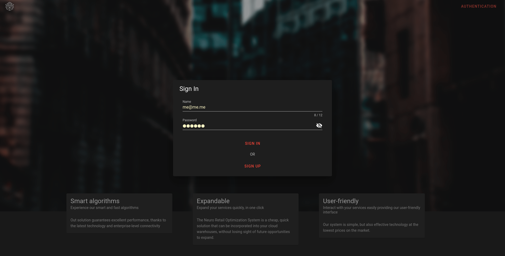
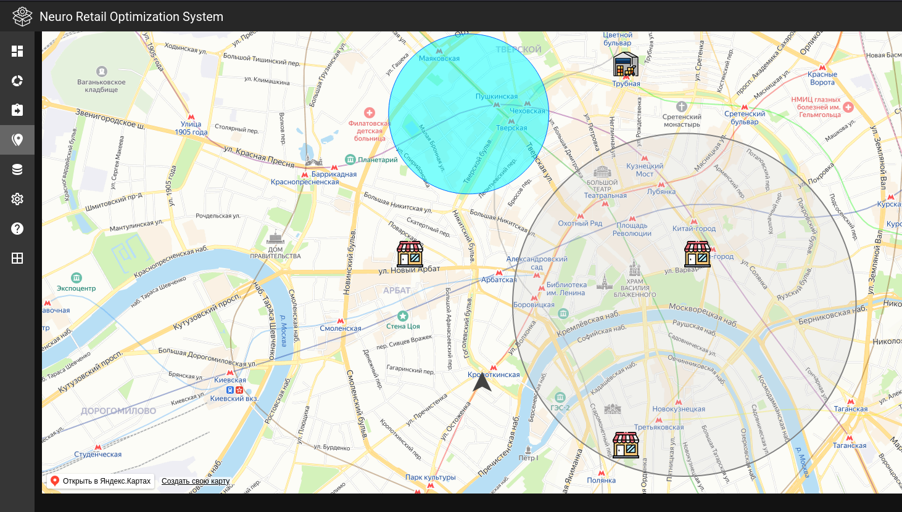

# NROS
Рекомендательная система управлением логистики и retail компаний с использованием технологий Машинного обучения. 
Logistics and retail control recommendation system using machine learning technology

### Landing

### Log in

### Map view

# Участники команды ( members )

- [Илья Шабанов](https://github.com/shabashaash)
- [Дмитрий Косенко](https://github.com/MrKhozyin)
- Десятченко Илья (That's me)
- [Дмитрий Григорян](https://github.com/MrSalatikRU)
- Антон Шадрин
- Кирилл Абрамкин
- Лев Тулявко
- Субботин Артем
- Ярослав Звонков

This project avaliable on [GH pages](https://idf3da.github.io/NROS/).

: |
